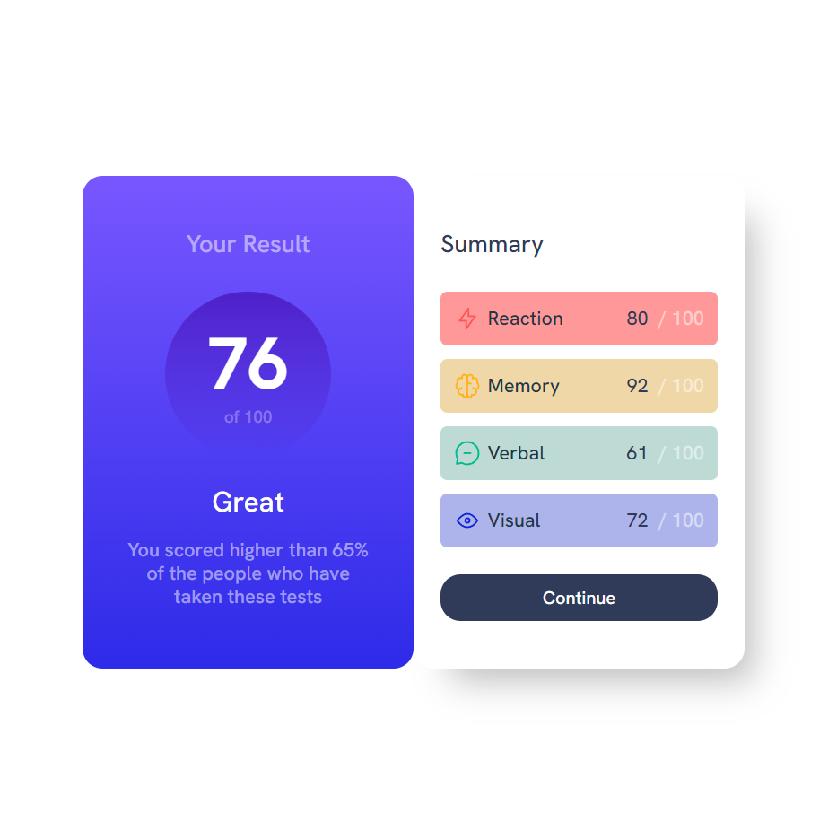

# Frontend Mentor - Results summary component

> SCSS + react + vite // 위의 이미지는 디자인을 참고하여 제가 만든 컴포넌트 이미지 입니다.

## 해야할 것

- [x] 데스크탑 뷰

- [ ] 모바일 뷰

## 스타일 가이드

- design 폴더에 데스크탑/ 모바일뷰 디자인 시안 제공

- 폰트 웨이트는 해당 연습에서 필요없으므로 삭제하였음 google font CDN을 통해서 사용해도되며 로컬에서 써도 된다.

  - CDN은 사용해봐서 폴더에 static한 폰트를 저장해서 불러와서 사용

- 스타일 가이드에 추가적으로 필요한 컬러템플릿 등의 정보가 담겨있음
  - 컬러 템플릿을 참고하여 전역 변수로 컬러 세팅 완료

## 회고 및 느낀점

- SCSS랑 리액트 컴포넌트 상성이 안 좋은 거 같다.
- 오히려 더 복잡해지는 느낌, Styled components(CSS-in-js)를 썼을 때는 몰랐는데 props를 CSS에 내려줄 수 있는 건 엄청나게 편리한 것이었다.
- 변수 활용하고 그런 건 좋긴한데.. SCSS를 사용할바엔 styled-component를 사용하는게 CSS 코드를 재사용하기도 좋을 거 같다.
- flex와 aspect-ratio 는 반응형으로 가로세로 비를 유지시켜주는 속성임을 명심
